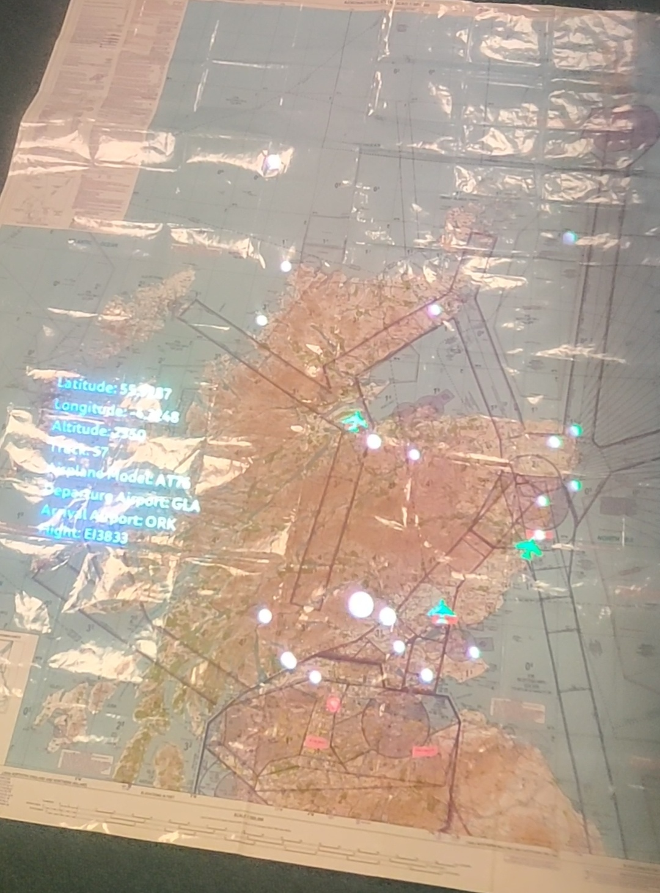

# Airplane Tracker

The Magic Leap system was used to build a 3D data visualization of the airplanes that are currently in Scotland's airspace. 

<table>
  <tr>
    <td></td>
    <td></td>
  </tr>
</table>

# Details

## Current idea

The graph is plotted as soon as it tracks the image of the map in the physical world. Using the bumper button on the Magic Leap controller, one can select different data points and get the details of the airplane that the data point represents.
Details include:
1. Latitude of the current position of the plane
2. Longitude of the current position of the plane
3. Altitude of the current position of the plane
4. Track followed
5. Model of the airplane
6. Departure airport
7. Arrival airport
8. Name of the flight

The graph can also be interacted with using the following hand gestures:
1. Right.OpenHandBack - Move around
2. Right.Fist - Hold the graph in current location
3. Left.OpenHandBack - Zoom into the graph
4. Left.Fist - Zoom out the graph
5. Left.Ok - Rotate the graph to change plane

## Future development

When a data point is selected, it would enlarge and show the image of the model of the plane. 

# Data source

Real time data is used in this application. The data was taken from https://www.flightradar24.com/57.23,-4.23/7

# Real life usage

In the future, such applications can benefit the Air Traffic Services to monitor the flights. 
